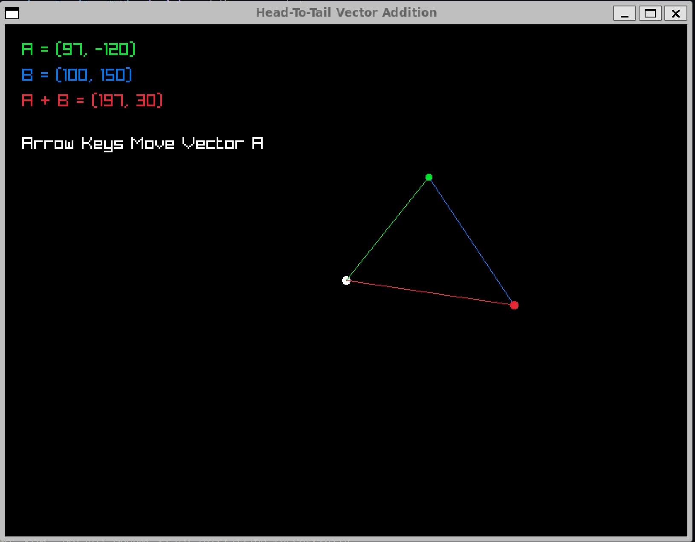
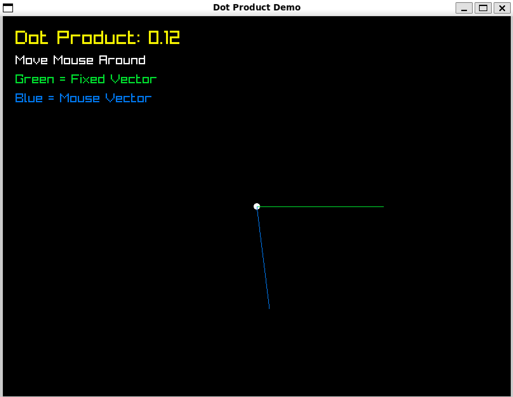
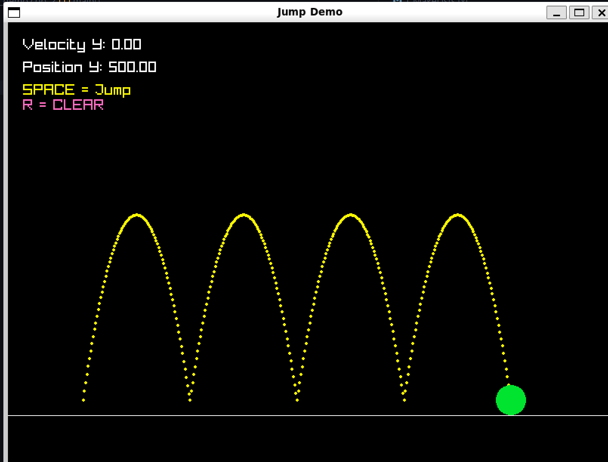

# GameMath

A small game mathematics library and visualization playground built with C++ and Raylib.

The goal of this project is to learn game development mathematics by implementing concepts from scratch and visualizing them in real time.

## Features

### Vector

* Length
* Length Squared
* Normalize
* Dot Product
* Vector Addition
* Vector Subtraction
* Scalar Multiplication
* Scalar Division

### Point

* Point + Vector operations

## Demos

### Vector Addition

Visualizes vector addition using the head-to-tail method.

### Dot Product

Visualizes the relationship between vectors and how the dot product changes with direction.

### Jump Physics

Demonstrates projectile motion using:

* Position
* Velocity
* Gravity
* Delta Time

Physics update:

```cpp
velocity += gravity * dt;
position += velocity * dt;
```

## Project Structure

```text
GameMath/
├── include/
├── src/
├── demos/
├── build/
└── CMakeLists.txt
```

## Build

```bash
cmake -B build
cmake --build build
```

## Run

Examples:

```bash
./build/vector_add_demo
./build/dot_demo
./build/jump_demo
```

# Demos

## Vector Addition

Visualizes vector addition using the head-to-tail method.



---

## Dot Product

Visualizes how the dot product changes as vector directions change.



---

## Jump Physics

Projectile motion using velocity, gravity and delta time.



## Why This Project Exists

Most game math tutorials focus on formulas.

This project focuses on building intuition by visualizing concepts such as vectors, normalization, dot products, and physics using Raylib.

The long-term goal is to grow this into a small reusable game mathematics library while learning the foundations of game programming.

## Completed

- [x] Vector Length
- [x] Vector Normalize
- [x] Dot Product
- [x] Vector Addition
- [x] Vector Subtraction
- [x] Scalar Multiplication
- [x] Scalar Division
- [x] Point Distance
- [x] Jump Physics Demo
- [x] Lerp Demo
- [x] Approach Demo
- [x] Distance Demo